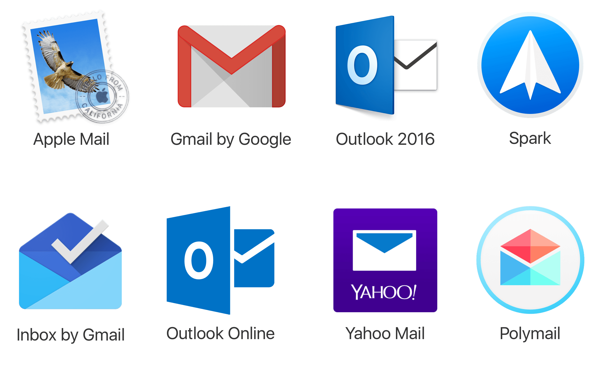

# Bulk email sender
Send the same email to thousands of email addresses!

I am Jude Wilson and I am 13 years old, I am currently learnign Python and know HTML, JavaScript, CSS, and PHP. Also if you are a college reading this then please help a research project and a fellow friend out and send a shirt or hat!

## How to edit
Open `emails.xlsx` with an excel sheet editor.
Change the email variables in a downword list.
Open `script.py` and follow the commented instructions!
[Now you need to use it](https://github.com/mr-winson/Mass-Email-Sender#how-to-use)

## How to use
[First you need to edit it](https://github.com/mr-winson/Mass-Email-Sender#how-to-edit)  
Clone this repo:
`git clone https://github.com/mr-winson/Mass-Email-Sender`
 
CD to it:
`cd ~/path/to/the/download`
 
Run the code:
`python script.py`
